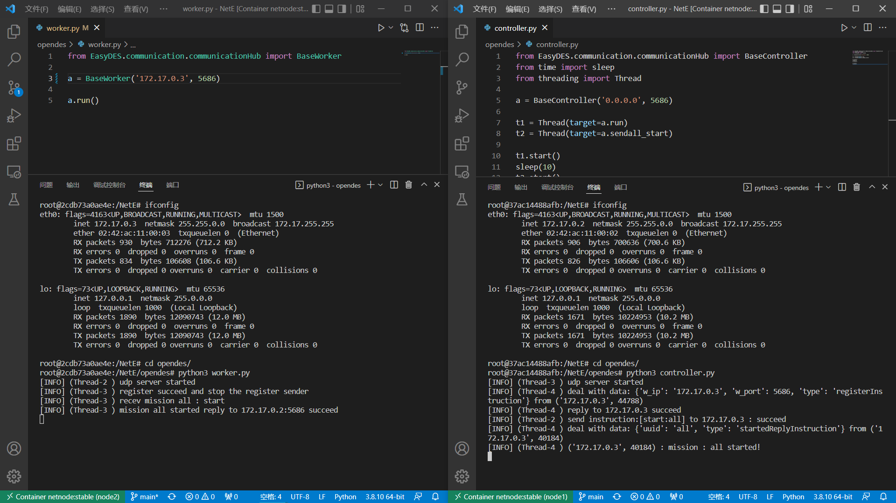

  <h1 align="center">
    EasyDES
  </h1>
  <h3 align="center">
     An open source Easy Distributed Experiment System : 分布式实验系统
  </h3>

 

## 目标功能
分布式分发任务，集群节点控制

controller:
- 总控制中心，运行一个web界面
- 连接所有的worker节点，向worker节点下发任务    ✔
- 接受worker的监控信息，任务结果回传统计
- webUI管理界面：任务设计，注册，控制，数据显示
- 与worker的通信，以及节点发现注册  ✔
- 任务注册系统  ✔

worker
- 监控执行状态，日志，运行结果回传
- 和controller通信  ✔

随项目的一个基础网络实验镜像：[netnode](https://github.com/NetExperimentEasy/NetNode)

## 进度
### 220426
通信模块测试通过    ✔

## 🔨 Todo :
- 任务模块：任务监控，统计回传
- webUI模块